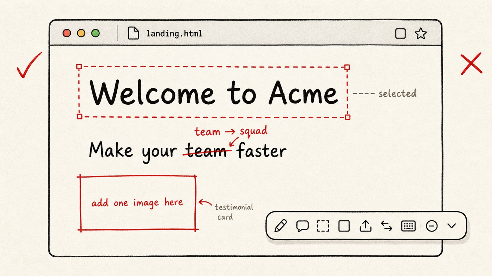
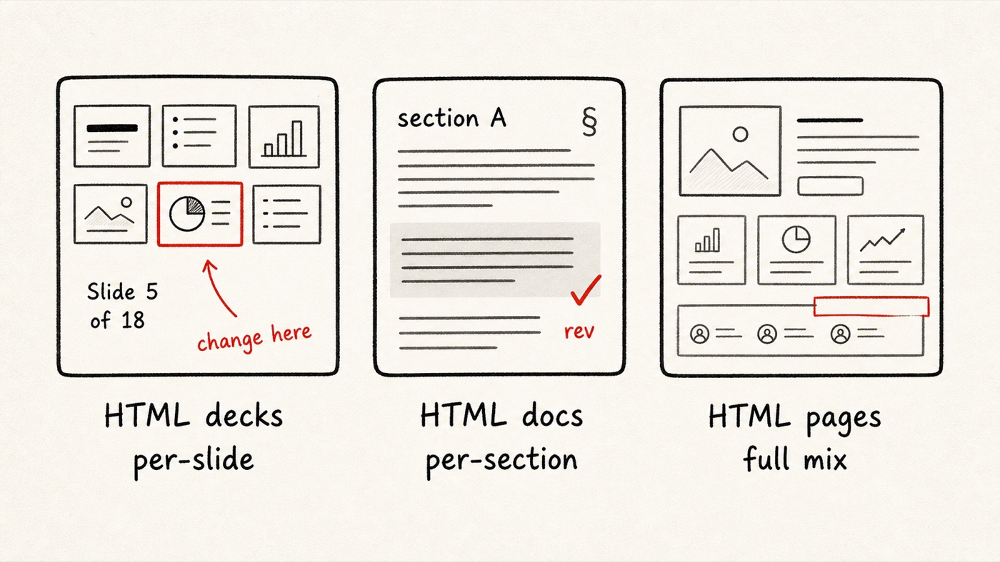

<div align="center">


# redline.html

**Visual feedback for any HTML — for the agent era.**

The agent writes HTML. You review it in the browser. Export back as HTML, PDF, or a structured feedback ZIP. Closed loop, no Figma, no Loom.

[](./CHANGELOG.md) [](./tests) [](./dist) [](./LICENSE)

**Languages:** **English** · [简体中文](./README.zh.md)

</div>

---

## What is this

A browser-injected HTML editor + a Claude Code skill + a Chrome extension. Three pieces that turn any HTML page into a feedback canvas — capture, transport, close the loop.

<p align="center"></p>

**One in-browser session, three transport formats:**

| Format | When | Who consumes |
|---|---|---|
| **HTML** (edit / preview) | Hand the review to another human, or keep it interactive | Designers / clients / receivers who keep annotating |
| **PDF** (vector / long-image) | Print, email, archive | Anyone who needs a static doc |
| **ZIP** (`session.json` + `.md` + images) | Feed back to Claude Code via `apply.mjs` | The agent, to patch source HTML |

Only the ZIP loop touches the source HTML again — HTML and PDF exports are one-way to humans.

## What's in the browser

<p align="center"></p>

- **Edit anything** — text, color, font, size, transform; double-click + ⌘S to save
- **Annotate** — drag region notes, paste screenshots, per-section feedback
- **Inspect** — eyedropper, spacing measurement (Alt+hover), style panel, audit mode
- **Compare** — before / after toggle (O), see the diff against original
- **Multi-select + undo** — Shift+click, marquee, ⌘Z / ⌘⇧Z
- **Keyboard-driven** — `?` opens the full shortcut sheet (modes / selection / feedback / view / pointer / export)

## Install — skill only (recommended for AI-generated HTML)

```bash
git clone https://github.com/Dongke-X/redline.git
cd redline && npm install && npm run build:ext
npm run install:skill          # copies skill/ to ~/.claude/skills/redline/
```

In Claude Code:
```
you:    "prep ./report.html for review"
claude: runs prepare.mjs → injects editor + copies redline.js next to it
        ↓
open report.html in your browser, press F to open feedback panel,
edit, then Save → ZIP downloads to ~/Downloads
        ↓
you:    "apply the redline feedback"
claude: reads ZIP, patches ./report.html
```

## Install — Chrome extension (for live URLs / staging / file://)

1. `npm run build:ext`
2. Chrome → `chrome://extensions/` → toggle Developer mode
3. Load unpacked → select `extension/`
4. Click the toolbar Redline icon on any page → injects the editor

Web Store submission is in progress. See [SUBMISSION_CHECKLIST.md](./SUBMISSION_CHECKLIST.md).

## HTML transport — hand off the review without Claude or the extension

The HTML export lets you pass review to anyone who has a browser. No skill, no extension required on the receiving end.

- **Editable HTML** — a single `.html` with the full redline editor embedded. Receiver double-clicks to open and keeps annotating. Every export bumps a `revision` chain (`revisionId` / `parentRevisionId` / `exporter`) so future versions can be diffed
- **Preview HTML** (read-only) — same single-file shape, but editing is locked. A built-in print button in the corner lets the receiver one-click to PDF. Good for client review where you don't want them to modify
- **Auto image optimization** — any image larger than 500 KB is transcoded to WebP @ 80 % during export (SVG / GIF skipped, original kept if WebP comes out larger). Typically 60–80 % smaller files
- **Recipient UX** — editable HTML shows a one-time welcome cue on the edit FAB so the receiver knows where to start; read-only HTML auto-injects the print button

## Three core scenarios

<p align="center"></p>

| | When | What you mark up | What ships |
|---|---|---|---|
| **HTML decks** | Reveal.js / `<deck-stage>` / plain HTML slides | per-slide text edits, region notes | `section: slide-N` tagged on each edit |
| **HTML docs** | Long-form HTML reports, RFCs, white papers | section annotations, paragraph rewrites | `perSection` feedback grouped by § |
| **HTML pages** | Agent-generated landings, dashboards, prototypes | full mix: edits + annotations + screenshots | unified `edits[]` + `annotations[]` + `attachments[]` |

See [examples/landing.html](./examples/landing.html) for a live walkthrough.

## How the skill resolves selectors

When `apply.mjs` writes back, it tries the selector strategies in order:

1. **id** — fastest, most stable
2. **fbId** — Redline-internal data attribute, survives DOM reordering
3. **cssPath** — generated CSS selector path
4. **contentHash** — sample of element's text content + tag name

So even if the agent regenerates the HTML between your review and the patch, redline can still find the right element via content matching.

## Privacy

Zero collection. No servers, no analytics, no third-party SDKs. Everything stays in your browser and on your disk. See [PRIVACY.md](./PRIVACY.md).

## Development

```bash
npm install              # esbuild + vitest + happy-dom
npm run build            # → dist/redline.js (minified, ~238kb)
npm run build:ext        # build + copy bundle to extension/ + skill/
npm run watch            # watch mode for src/
npm test                 # vitest, 18 tests
npm run demo             # opens examples/standalone.html in browser
node tests/e2e-zip.mjs   # ZIP round-trip + selector resolution end-to-end
```

Architecture:
- `src/` — widget source (modular, ESM)
- `dist/redline.js` — bundled IIFE for browser injection
- `extension/` — Chrome MV3 extension shell (popup, options, i18n)
- `skill/` — Claude Code skill (`prepare.mjs`, `apply.mjs`, SKILL.md)
- `docs/` — GitHub Pages output (landing + privacy)
- `examples/` — standalone demos and the marketing landing pages

## Links

- 🌐 Landing page: [examples/landing.html](./examples/landing.html) ([中文](./examples/landing.zh.html))
- 📋 Changelog: [CHANGELOG.md](./CHANGELOG.md)
- 🔒 Privacy: [PRIVACY.md](./PRIVACY.md)
- 🛠 Contributing: [CONTRIBUTING.md](./CONTRIBUTING.md)
- 📦 Web Store submission: [SUBMISSION_CHECKLIST.md](./SUBMISSION_CHECKLIST.md)

## License

[MIT](./LICENSE) © 2026 Dongke-X · 小红书 [@东可 Talk](https://www.xiaohongshu.com/user/profile/5a8e8eb8db2e600ca3d43349)
