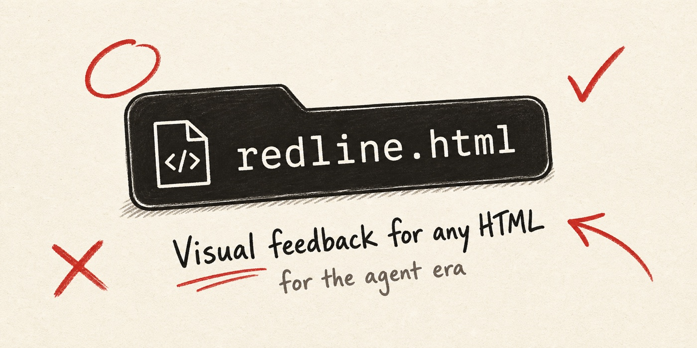
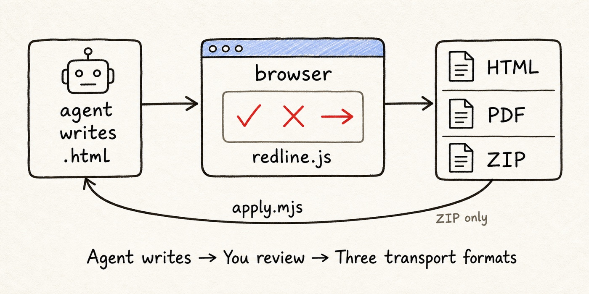
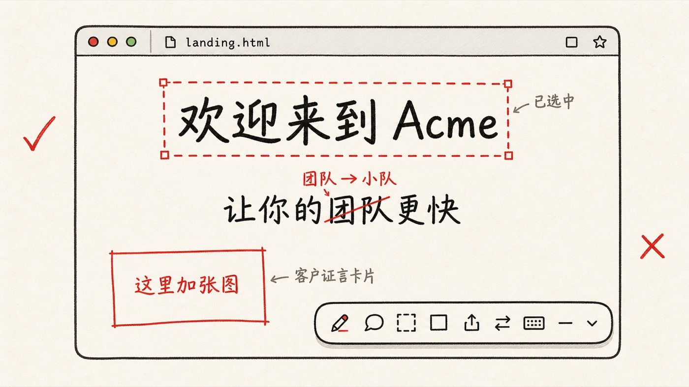
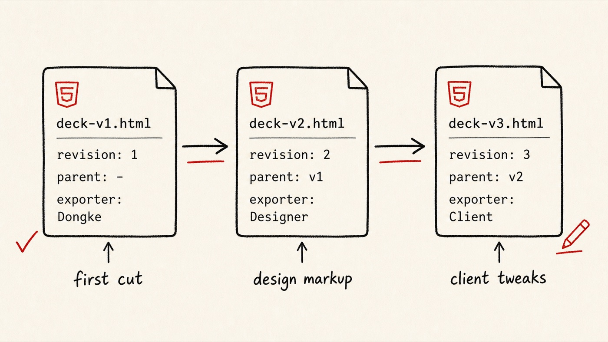
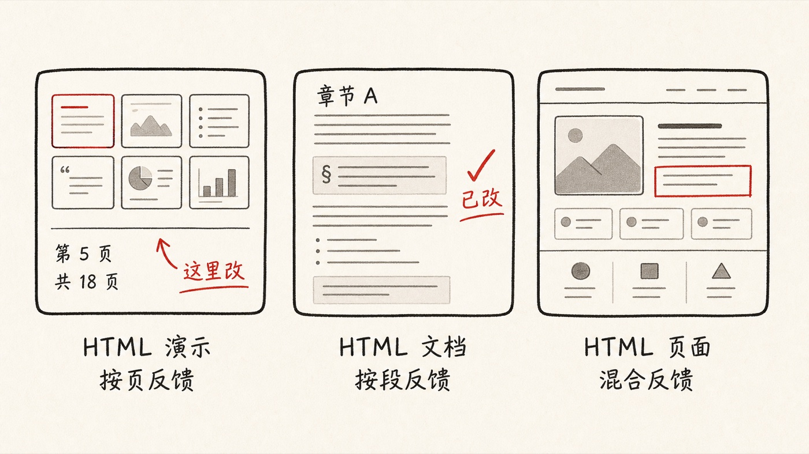
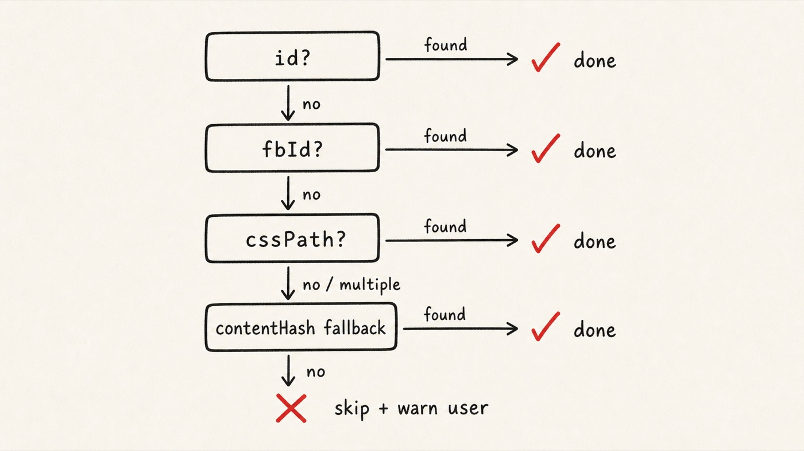

<div align="center">



# redline.html

**给 AI 时代的 HTML 反馈工具。**

agent 给你写 HTML，你在浏览器里 review，反馈以 HTML / PDF / ZIP 三种形态导出 —— 闭环，不用 Figma，不用录 Loom。

[](./CHANGELOG.md) [](./tests) [](./dist) [](./LICENSE)

**语言：** [English](./README.md) · **简体中文**

</div>

---

## 是什么

浏览器内的 HTML 编辑器 + Claude Code skill + Chrome 扩展。三件东西打包 —— 把任何 HTML 页变成反馈画布，做到「捕获 / 传输 / 闭环」。

<p align="center"></p>

**同一个浏览器 session，三种导出格式：**

| 格式 | 什么时候用 | 谁消费 |
|---|---|---|
| **HTML**（编辑 / 预览） | 把 review 转交给另一个人，或者让它保持可继续标注 | 设计师 / 客户 / 接力标注的人 |
| **PDF**（矢量 / 长图） | 打印、邮件、归档 | 需要静态文档的任何人 |
| **ZIP**（`session.json` + `.md` + 图片） | 走 `apply.mjs` 回到 Claude Code | agent，用来把改动 patch 回源 HTML |

只有 ZIP 那条线会回流到源 HTML —— HTML / PDF 是单向传给人的。

## 浏览器里都能干什么

<p align="center"></p>

- **改任何东西** —— 文字、颜色、字体、尺寸、transform；双击 + ⌘S 保存
- **标注** —— 拖矩形画区域反馈、贴截图、写每节备注
- **检查** —— 取色器、间距测量（Alt+悬停）、样式面板、审计模式
- **前后对比** —— 按 O 切换看原稿 / 看改后，差异一目了然
- **多选 + 撤销** —— Shift+点击、框选、⌘Z / ⌘⇧Z
- **键盘党友好** —— 按 `?` 弹完整快捷键表（模式 / 选区 / 反馈 / 视图 / 鼠标手势 / 导出）

## 安装 —— 只装 skill（推荐给 AI 生成的 HTML）

```bash
git clone https://github.com/Dongke-X/redline.git
cd redline && npm install && npm run build:ext
npm run install:skill          # 拷 skill/ 到 ~/.claude/skills/redline/
```

在 Claude Code 里：
```
你:    "给 ./report.html 加 redline 让我 review"
claude: 跑 prepare.mjs → 注入编辑器 + 同目录拷 redline.js
        ↓
浏览器打开 report.html，按 F 开反馈面板，
做改动，Save → ZIP 自动下载到 ~/Downloads
        ↓
你:    "应用 redline 的反馈"
claude: 读 ZIP，把改动写回 ./report.html
```

## 安装 —— Chrome 扩展（review 远程 URL / staging / file://）

1. `npm run build:ext`
2. Chrome 打开 `chrome://extensions/` → 开启"开发者模式"
3. "加载已解压的扩展程序" → 选 `extension/`
4. 工具栏点 Redline 图标 → 注入编辑器

应用商店上架准备中，详见 [SUBMISSION_CHECKLIST.md](./SUBMISSION_CHECKLIST.md)。

## HTML 转交 —— 不依赖 Claude 也不依赖扩展

HTML 导出让你把 review 转给任何有浏览器的人。接收端不用装 skill / 不用装扩展。

<p align="center"></p>

- **编辑 HTML** —— 单个 `.html` 文件，redline 编辑器 inline 在里面。接收方双击打开继续标。每次导出都会推进一段 `revision` 链（`revisionId` / `parentRevisionId` / `exporter`），后续可做版本 diff
- **预览 HTML**（只读）—— 同样是单文件，但编辑入口锁住。右下角内置打印按钮，接收方一键转 PDF。**适用**：给客户演示、不让对方改
- **自动图片压缩** —— 单图 >500KB 自动转 WebP @ 80%（SVG / GIF 跳过，转得更大则回原图），平均瘦 60–80%
- **接收方 UX** —— 编辑 HTML 一次性给编辑 FAB 加呼吸光 + 4 秒 tooltip，提示接收方从哪开始；只读 HTML 自动注入打印按钮

## 三个核心场景

<p align="center"></p>

| | 什么时候用 | 你标注什么 | 输出 |
|---|---|---|---|
| **HTML 幻灯片** | Reveal.js / `<deck-stage>` / 纯 HTML slides | 按页改文字、按页加备注 | 每条 edit 带 `section: slide-N` |
| **HTML 文档** | 长文 HTML 报告 / RFC / 白皮书 | 按章节标注、按段落改写 | `perSection` 反馈按 § 归类 |
| **HTML 网页** | agent 生成的 landing / dashboard / 原型 | 全套：edits + annotations + screenshots | 统一 `edits[]` + `annotations[]` + `attachments[]` |

完整演示见 [examples/landing.zh.html](./examples/landing.zh.html)。

## Skill 怎么定位元素

<p align="center"></p>

`apply.mjs` 把反馈写回时按这个优先级匹配 selector：

1. **id** — 最快、最稳
2. **fbId** — Redline 内部用的 data 属性，DOM 重排不影响
3. **cssPath** — 生成的 CSS 路径
4. **contentHash** — 元素文本采样 + 标签名

所以即使 agent 在你 review 完之后又重新生成了 HTML，redline 也能靠 contentHash 兜底找到正确的元素。

## 隐私

零收集。没有服务器、没有埋点、没有第三方 SDK。所有数据都留在你浏览器和硬盘里。详见 [PRIVACY.md](./PRIVACY.md)。

## 开发

```bash
npm install              # esbuild + vitest + happy-dom
npm run build            # → dist/redline.js（minified，~238kb）
npm run build:ext        # build + 同步 bundle 到 extension/ 和 skill/
npm run watch            # src/ watch 模式
npm test                 # vitest，18 个 test
npm run demo             # 浏览器打开 examples/standalone.html
node tests/e2e-zip.mjs   # ZIP 端到端 + selector 解析测试
```

目录结构：
- `src/` — widget 源码（模块化 ESM）
- `dist/redline.js` — 浏览器注入用的 IIFE bundle
- `extension/` — Chrome MV3 扩展骨架（popup / options / i18n）
- `skill/` — Claude Code skill（`prepare.mjs` / `apply.mjs` / SKILL.md）
- `docs/` — GitHub Pages 内容（landing + 隐私）
- `examples/` — 独立 demo + 市场化 landing 页

## 链接

- 🌐 着陆页：[examples/landing.zh.html](./examples/landing.zh.html)（[English](./examples/landing.html)）
- 📋 更新日志：[CHANGELOG.md](./CHANGELOG.md)
- 🔒 隐私政策：[PRIVACY.md](./PRIVACY.md)
- 🛠 贡献指南：[CONTRIBUTING.md](./CONTRIBUTING.md)
- 📦 上架清单：[SUBMISSION_CHECKLIST.md](./SUBMISSION_CHECKLIST.md)

## 许可

[MIT](./LICENSE) © 2026 Dongke-X · 小红书 [@东可 Talk](https://www.xiaohongshu.com/user/profile/5a8e8eb8db2e600ca3d43349)
